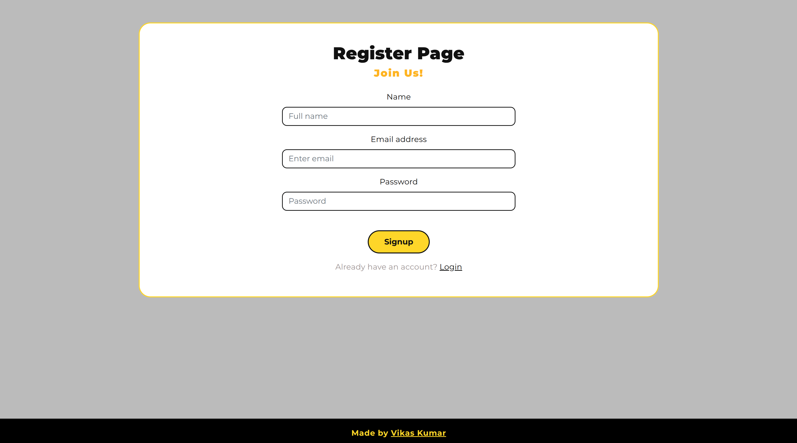

# Expense Tracker - MERN Stack Application
A complete expense tracking service built with the MERN stack (MongoDB, Express.js, React, Node.js).

---

## Screenshots

- 
- 
- 
- 
- 

---

## Features
- **Expense Tracking**: Add, edit, and delete transactions (credit/expense) with optional descriptions.
- **Category Analytics**: View category-wise analytics, balance, and percentage splits.
- **User Authentication**: Register and login securely.
- **Responsive Design**: Minimal, vibrant, and accessible UI for desktop and mobile.
- **Color Coding**: Expenses in red (with negative sign), credits in green, rupee sign for all amounts.
- **Date Handling**: Default date is today for new transactions; filter by last week, month, year, or custom range.
- **Modals**: All modals use default Bootstrap close buttons and styling.

---

## Tech Stack
- **Frontend**: React.js
- **Backend**: Node.js with Express.js
- **Database**: MongoDB
- **Styling**: Custom CSS, Bootstrap

---

## Project Structure
```
expensefinal/
├── backend/                   # Backend Node.js/Express application
│   ├── app.js
│   ├── package.json
│   ├── config/
│   │   └── config.env
│   ├── controllers/
│   │   ├── transactionController.js
│   │   └── userController.js
│   ├── DB/
│   │   └── Database.js
│   ├── models/
│   │   ├── TransactionModel.js
│   │   └── UserSchema.js
│   └── Routers/
│       ├── Transactions.js
│       └── userRouter.js
├── frontend/                  # Frontend React application
│   ├── package.json
│   ├── public/
│   │   ├── favicon.ico
│   │   ├── index.html
│   │   ├── logo192.png
│   │   ├── logo512.png
│   │   ├── manifest.json
│   │   └── robots.txt
│   └── src/
│       ├── App.css
│       ├── App.js
│       ├── index.css
│       ├── index.js
│       ├── logo.svg
│       ├── assets/
│       │   └── loader.gif
│       ├── components/
│       │   ├── CircularProgressBar.css
│       │   ├── CircularProgressBar.js
│       │   ├── Footer.js
│       │   ├── Header.js
│       │   ├── LineProgressBar.js
│       │   ├── Spinner.js
│       │   └── style.css
│       ├── Pages/
│       │   ├── Auth/
│       │   │   ├── auth.css
│       │   │   ├── Login.js
│       │   │   └── Register.js
│       │   └── Home/
│       │       ├── Analytics.js
│       │       ├── home.css
│       │       ├── Home.js
│       │       ├── ModelForm.js
│       │       └── TableData.js
│       └── utils/
│           └── ApiRequest.js
├── .gitignore
└── README.md
```

---

## API Endpoints
| Method | Endpoint                      | Description                        |
|--------|-------------------------------|------------------------------------|
| POST   | /api/auth/register            | Register a new user                |
| POST   | /api/auth/login               | Login user                         |
| POST   | /api/v1/addTransaction        | Add a new transaction              |
| POST   | /api/v1/getTransaction        | Get all transactions (with filters)|
| PUT    | /api/v1/updateTransaction/:id | Update a transaction               |
| POST   | /api/v1/deleteTransaction/:id | Delete a transaction               |

---

## Installation & Setup
### Prerequisites
- Node.js (v16+ recommended)
- MongoDB (local, use MongoDB Compass)

### Clone the repository
```bash
git clone https://github.com/vikaskumar-23/expensefinal.git
cd expensefinal
```

### Backend Setup
```bash
cd backend
npm install
```
Create a `.env` file in `backend/config/config.env` with the following:
```
MONGO_URL=mongodb://localhost:27017/expensefinal
PORT=5000
NODE_ENV=development
```
Start the backend:
```bash
npm run dev
```

### Frontend Setup
```bash
cd ../frontend
npm install
npm start
```

### Access the application
Open your browser and navigate to [http://localhost:3000](http://localhost:3000)

---

## Usage
- Register a new user or login.
- Add, edit, or delete transactions.
- Filter by type, date, or category.
- View analytics and summary charts.
- All changes are reflected instantly in the UI and analytics.

---

## MongoDB Schema
### User
- `name`: User's name
- `email`: User's email (unique)
- `password`: Hashed password
- `transactions`: Array of transaction objects
- `createdAt`: Account creation date

### Transaction
- `title`: Transaction title
- `amount`: Transaction amount
- `category`: Category of transaction
- `description`: (optional) Description
- `transactionType`: 'credit' or 'expense'
- `date`: Date of transaction
- `user`: Reference to user
- `createdAt`: Transaction creation date


